# Helium

I love the vision, but the core team chose to ignore a DAO vote.

The tech is still kinda cool, but it no longer stirs my soul.

## Original Motivation

I'm bad at trading crypto-currency. It stresses me out, and I'm not mature enough to set-it-and-forget-it.

So, I'm changing my approach. I need a productive way to engage my curiosity, because price-speculation just doesn't do it for me. I've decided to actively participate in a fun project that is interesting, social, and involves physical hardware.

I originally purchased 1 [Helium hotspot](https://www.helium.com/mine) for $500 in 2019. I'm going to focus primarily on having fun, learning, and adding value to the project. I'm not putting any more money into it -- just time, energy, and social-capital!

## Progress

Starting with the most recent...

### November 2021

* Learning: `B`
* Fun: `B`
* Finances: `A+`

I'm done putting time into this project -- it was _really_ fun while it lasted (pics below), but now most of my hotspots earn less than 0.2 HNT per day. After factoring in the revenue-split with my hosts, I only made 150 HNT last month (with 30 hotspots + 1 validator). It's becoming slightly less fun, and I'm not learning as much.

This week, I began the process to unstake my validator, but the funds won't be liquid for ~5 months (due to the protocol's cooldown period).

#### Financial Retro

* Original investment: $500 (1 miner)
* Realized gains: $100k+
* Unrealized gains: $300k+ (9k HNT)
* Passive income: ~$80k / yr (and steadily declining)

#### Good Decisions

* Buying the original hotspot in 2019 was a _great_ decision
* Buying more hotspots in 2020 / 2021 was a _great_ decision

#### Bad Decisions

* Selling HNT to pay for the new hotspots was a _terrible_ decision

#### Retro

Financially, I would have been better off just buying the original hotspot & leaving it alone. I lost a lot of money by selling tokens to buy more infrastructure:

* The coin price has increased 39x since I placed that order
* The hardware was delayed ~6 months
* The mining rewards per hotspot decreased significantly during those 6 months

I have no regrets -- I really enjoyed building out the People's Network, and my goal wasn't to make a bunch of money. It was to have fun & help build something, and I certainly did that!

#### Lessons

In future crypto projects:

* Be early
* HODL
* Build something with friends

People drive themselves crazy trying to buy & sell at optimal times, and the vast majority of us will fail at that game. I'll try to pick more projects where I can just focus on building something & trust that the score will take care of itself.

If this sounds like BS, then maybe you're too cynical about the world.

***

### July 2021

* Learning: `A`
* Fun: `A`
* Finances: `A+`

This is a lot of fun. I've got ~25 hotspots deployed, all managed by my smartest friends. I sent out ~18 giant antennas as well, and some installs are more ambitious than others:

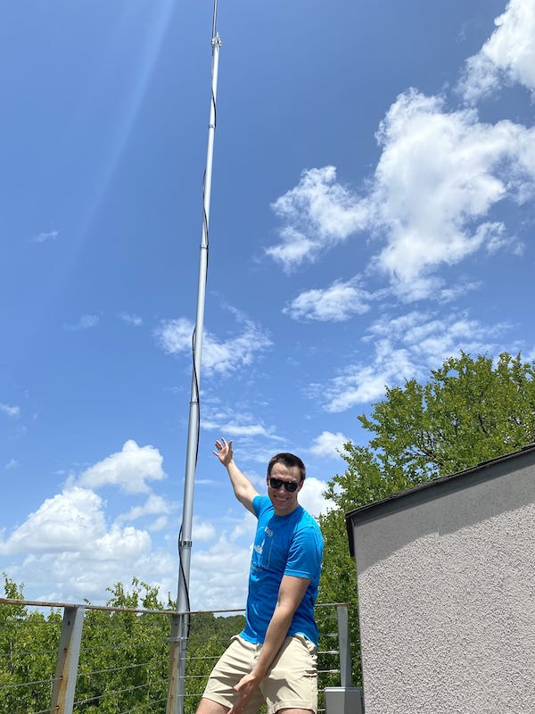
^^ That's me, next to an antenna that Nick & I installed together using a Harbor Freight flagpole on someone's roof deck.

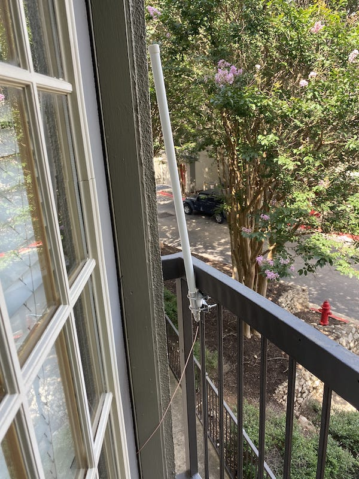
^^ Some friends with apartments had to get scrappy

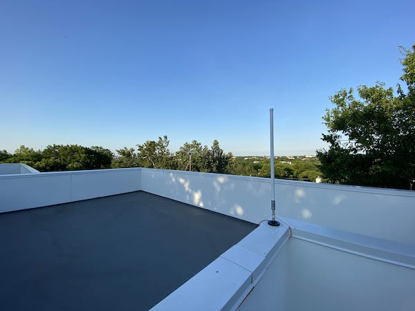
^^ The magnetic mounts came in handy, although weather-proofing and grounding is still non-trivial.

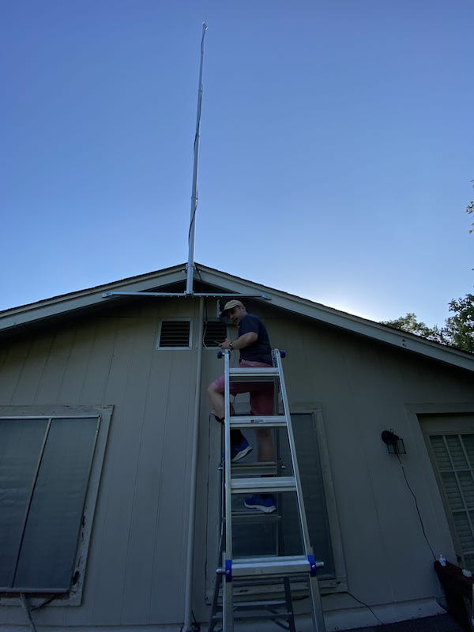
^^ This really feels like "the people's network"

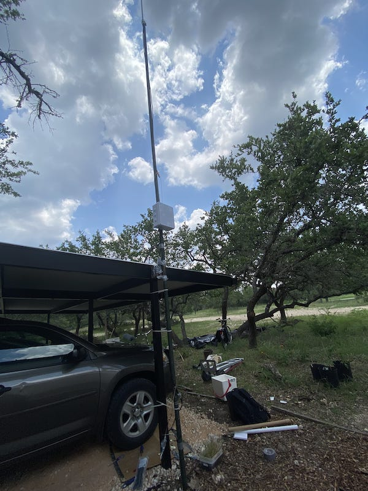
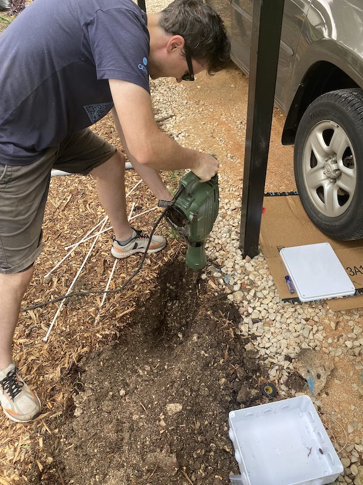
^^ It was a really fun install to do with friends

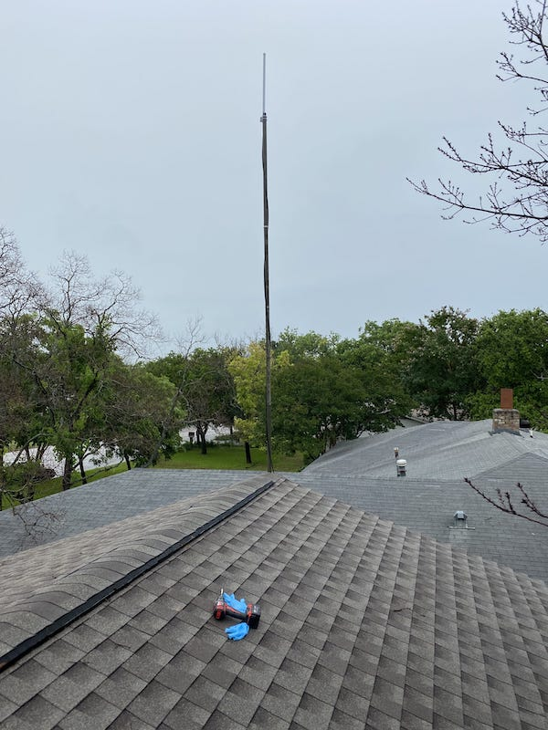
^^ My highest earner, Nick. I've given him more hotspots, and lowered my % share from the new ones I give him.

I decided to let each friend create a wallet and own the hotspot themselves, and I just trust them to send me 50% of their tokens each month. I'm trying to be as hands-off as possible with this, so I wrote a script called Gazzini Bot to "invoice" them each month. All but 1 have paid, so I consider it a win.

"Gazzini Bot" also sends me & Nick a daily summary of hotspot activity, so we can notice problems without constantly refreshing the stats for each hotspot (it's pretty addictive haha).

I made 600 HNT last month, which is around $7k at the current prices. I'm selling all newly earned tokens each month, the process looks like this:

* Gazzini Bot invoices my network
* They pay HNT to my wallet
* I send the HNT to an exchange that supports this coin
* I trade HNT <-> BTC
* I transfer the BTC to my personal wallet
* I send some of the BTC to some of my friends (as a favor, I offer to convert their share of HNT if they want)
* I send most of the BTC to my coinbase account
* I trade BTC <-> USD and cash out to my bank account

I'm holding my early earnings, and selling my newly minted tokens each month.

I recently staked a validator (I got some friends to throw in some tokens, so I only had to stake 8k HNT). I still have >1k HNT that I can sell whenever I want, and I sold ~1k
HNT to diversify into SOL and RAY.

I'm also unable to support anymore of my friends on this (I'm going for "passive income"), so when I recently got 6 more hotspots, I gave my top earner (Nick) as many as he wanted, and I'm letting him keep more than 50% of the profits from them. I'll still earn more while worrying less about them, so I see it as a win-win.

I've only got 4 more units coming, and I don't think I'll order anymore. It's been a lot of fun, but with the halving next month, I don't think it will be as lucrative (unless the tokens explode in value). I'm on track to make 900 HNT next month, but I expect that to drop to 450 HNT the following month.

It's become a pretty complex project to manage, but unsurprisingly, the best decision I made was to let my smart friends independently manage their own hotspots. When ranking my network by earnings, the engineers faaaaar outscore the non-engineers, and I think it's because they're more intrinsically interested in fiddling with this stuff to optimize it. They also ask fewer questions, which I appreciate immensely.

I sank a lot of time into this last month, and I'm hoping to coast on auto-pilot for the forseeable future.

Oh, and also, I'm an idiot.
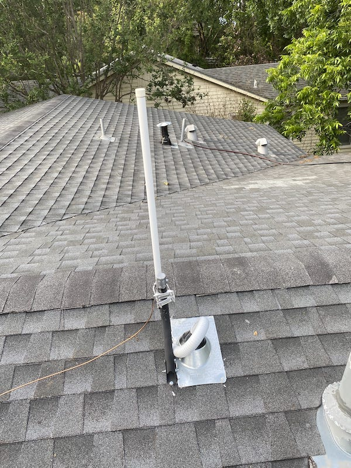

^^ I made a giant leak in my roof, fixed it fast though

***

### May 2021

* Learning: `C`
* Fun: `B`
* Finances: `A+`

My 10k tokens are now worth ~$15 each (although it's volatile). I have 1 hotspot running at my house, and another in Dublin that I'm splitting with a friend. I'm still waiting on 30 more to show up, but with these 2 hotspots, I earn $80 / day. I'm selling all the new income every 2 weeks and only holding my original bag (because even if the price suddenly drops, I'll be taxed on the income at this current price).

I found a friend to partially fund my validator (so I still maintain some liquidity). Unfortunately, this is complicated software, so staking still isn't actually available yet.

I just quit my full-time job to focus on [pooldash](/projects/posts/pooldash). I don't know how long this crypto-currency market will stay hot, but it's given me a window of financial independence, and I'm using it to try & build a more sustainable source of passive income. If it doesn't work out, I'll get another job (I like building software anyways).

***

### March 2021

* Learning: `B-`
* Fun: `C`
* Finances: `A+`
  * realized $10k profits
  * ordered 31 total more hotspots (using HNT)
  * holding 10k tokens at ~$6 each

#### Antenna

My friend Grayson suggested that I buy a bigger antenna to increase my earnings.

It worked. My single-hotspot earnings increased 10x (to ~20 tokens per day). Luckily, I had just helped my friend Nick install solar panels on his roof, so I was juuuuust comfortable enough to do this:
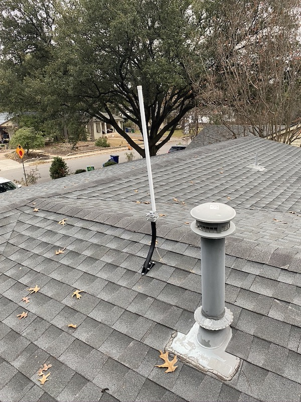

#### Supply Chain

I ordered 11 more hotspots (31 total). 0 have shipped. This is a weird crypto project, because a central authority (Helium) has to "bless" the private key of each miner, meaning that only certain manufacturers can create the hotspots. This, along with Covid & a bunch of geo-politics that I don't understand, means that the components are hard to find & shipping is delayed. I've ordered from 2 suppliers: CalChip and Nebra.

Lesson learned: don't give timeline estimates to friends, especially for things outside of my control. I got a bunch of people excited about Helium, but still haven't shipped them anything.

#### Price

The price has increased to $6 per token. That means my antenna makes $120 / day, which is absurd.

I don't know if the price will keep going up -- Optimists are talking about 5G hotspots, but that seems unrealistic (because of regulation). Pessimists are talking about satellite alternatives (Starlink etc...), but those currently require big, high-power devices.

I don't know if the price will go up or down, but I did sell more at $3.50, and I regret it.

Something is broken here -- I should feel good, not bad. I need to change my strategy...

#### Validator

To help the network grow, I might run a [validator node](https://www.helium.com/stake). I would have to "stake" 10,000 tokens to a server somewhere, and I would have to wait 5 months to sell them. This takes the "sell or hold" decision off the table, helps grow the network, and earns interest (in HNT).

But, it's risky, so I'm trying to get some friends to go in on it with me. Also, I've done similar things for ETH2 (I run a validator node wiht 32 ETH staked to it), but this is very different:

* They're using the validators to add hash-power to the network, which is a weird short-term goal for a proof-of-stake project
* It's received less scrutiny -- there aren't nearly as many eyeballs on HNT validator source code, and there are fewer (1?) off-the-shelf software implementations.

***

### November 2020

* Learning: `C-`
* Fun: `B`
* Finances: `A`
  * ordered 21 more hotspots (using HNT)
  * holding 12k tokens at ~$1.20 each

#### Buying Hotspots

I ordered 20 more, and I'm going to distribute them to friends in various cities, optimizing for location based on these principles:

[https://github.com/helium/HIP/blob/master/0017-hex-density-based-transmit-reward-scaling.md](https://github.com/helium/HIP/blob/master/0017-hex-density-based-transmit-reward-scaling.md)

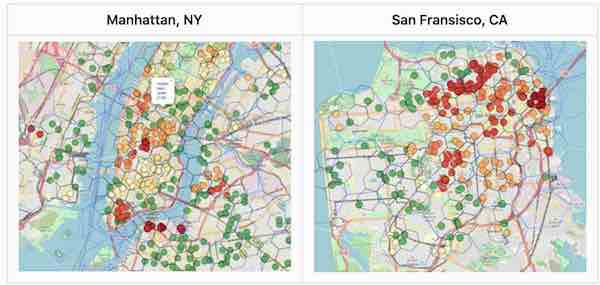

I think this will be more fulfilling than price-speculation:

* I'll get to call up a bunch of old friends in random places & ask them if I can put a money-printing machine in their apartment (well, it prints monopoly-money, anyways). We'll all get "rich" together!
* It's positive-sum. I'm not trading against everyone else. I'm generating value for the network. The entire point of Helium is to incentivize people to put these routers in particular locations.

That's the entire plan for now.

***
***

## Gutter

This is stuff that I wanted to write but didn't really fit in above:

### Backstory

In 2017, I got into Ethereum at $30, and then I bought _a ton_ of whacky crypto alt-coins. It was fun and mostly stupid, but I expected to invest in mostly losers and maybe 1 outsized winner (I should write an essay about this). Around this time, my smart friend Amhed told about a "cool project" called Helium, and I cashed out $500 to pre-order one of their first "hotspots". I was lucky to have met Amhed, lucky to have some crypto funny-money, and lucky that Helium chose Austin, TX as their launch city.

I was surprised when they actually shipped me a hotspot several months later. I was even more surprised by how good their mobile app was — it showed that I had 1 of only 102 routers in the entire world, and I wasn't in-range of anyone else (we lived in East-Austin at the time, not downtown). I promptly stopped thinking about Helium.

Fast-forward to today — there are 13,000+ hotspots all over the world, and my little 5-watt hotspot has mined over 17,000 HNT tokens (currently trading around $1.20 each). This is great, especially considering that all of my similar "investments" failed catastrophically. So... I'm leaning into it.

### Economics (2020)

I sold 5k tokens and spent the money on 20 more routers (Helium recently blessed a single 3rd-party manufacturer who sells them for $250 each). However, they're backordered, so I basically sent $5k to China with no guarantees, and it'll probably be months before my shipment arrives.

My tentative plan is to:

* Find friends in optimal locations
* Show them this article, ship them a hotspot
* Ask them to send me 1/2 of the tokens generated
* Profit!

The 2 big questions are:

1) How many tokens will these hotspots generate?

* I estimate an average of 4/day over the next year (mine currently earns 8/day).

2) How much will the tokens be worth?

* I dunno. Hopefully the price will stay above $1, but it might fall to 0.

So, optimistically, these hotspots will make 1,400 tokens in 12 months, and I'll get 700 of them. From 20 hotspots, that's 14,000 tokens for me, which is more than I spent to buy the routers. Of course, there are a few assumptions baked into that estimate 🤣.

It's very likely that we all make $0, but there is:

* high potential upside
* no financial risk ($2 / year of electricity)

...and it's fun!

***

### Self Reflection

I was actually too cynical about this project. I didn't think they'd really deploy 5G, but I now have a 5G hotspot, and Dish Network ordered 3 million of them!

***

### Fun Pictures

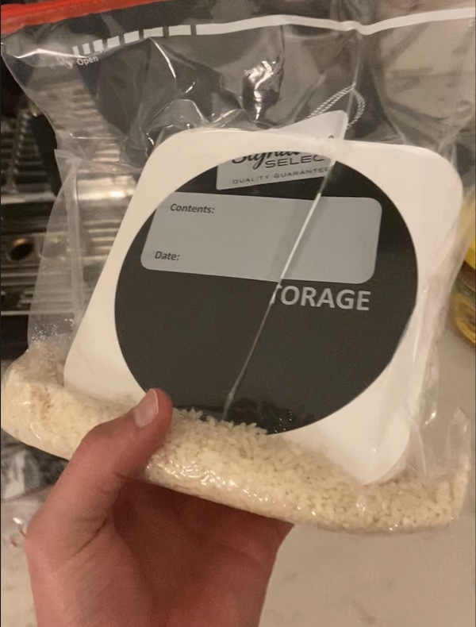
^^ My first hotspot, after I forgot to loop the antenna cable & it took a shower (more like a bath!)

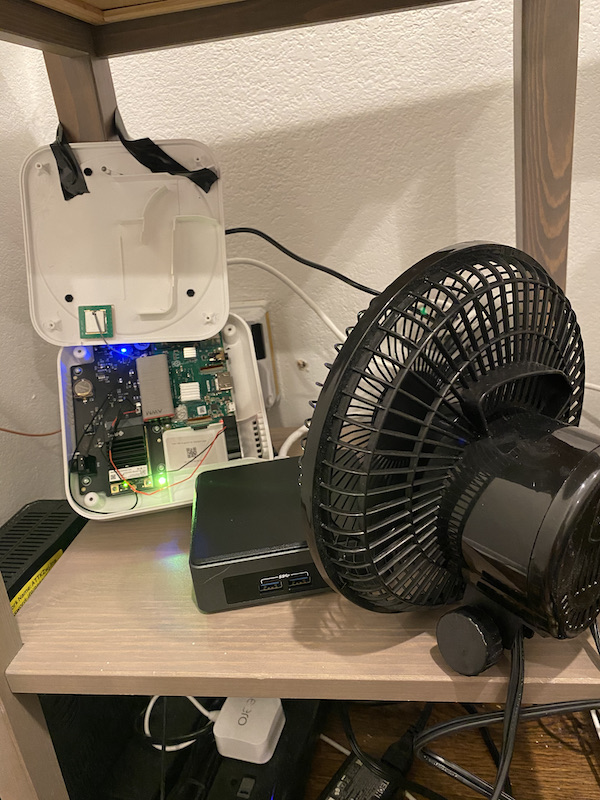
^^ After a couple years, this hotspot just wanted to die in peace... but I needed HNT!

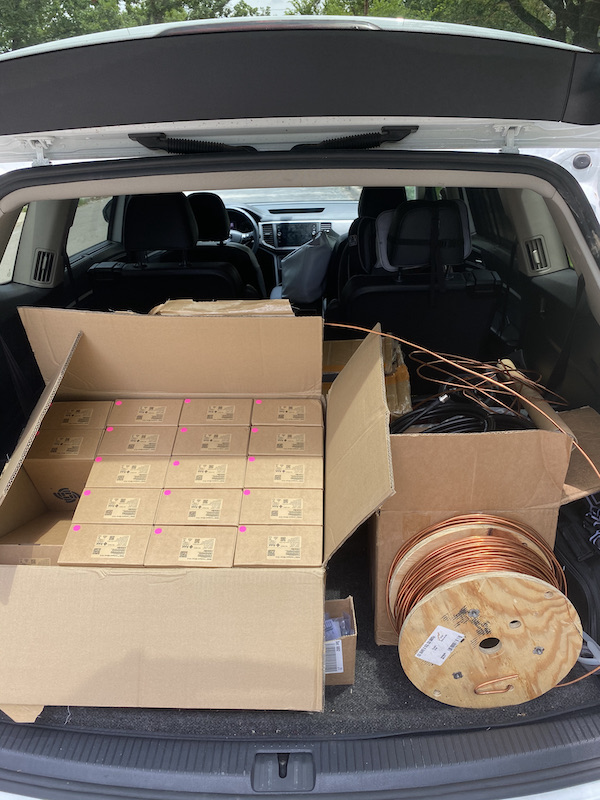
^^ I had a lot of fun delivering & installing these things.
