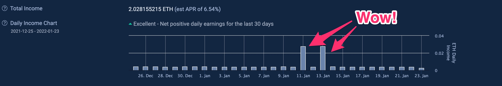
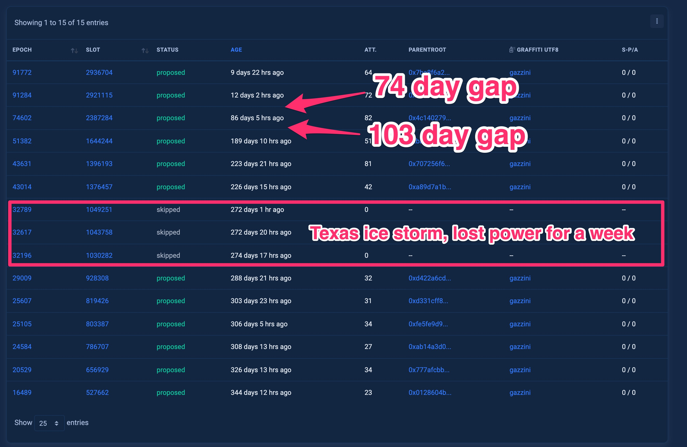
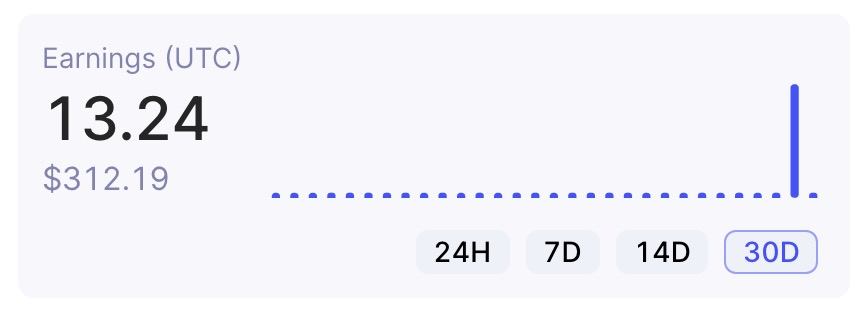
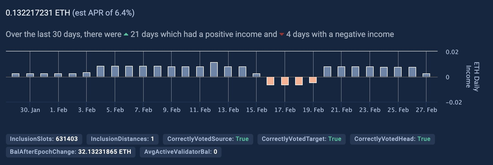
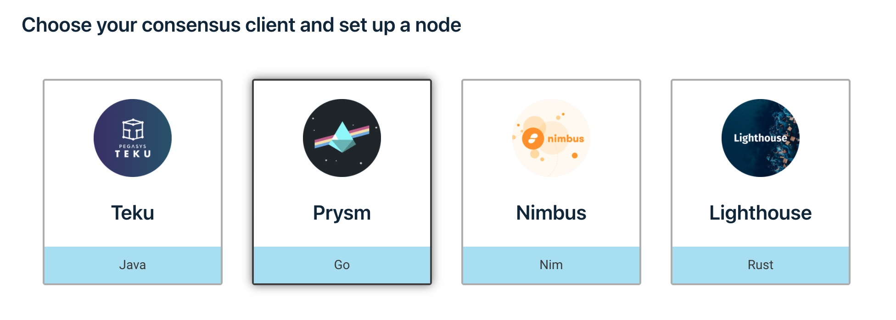
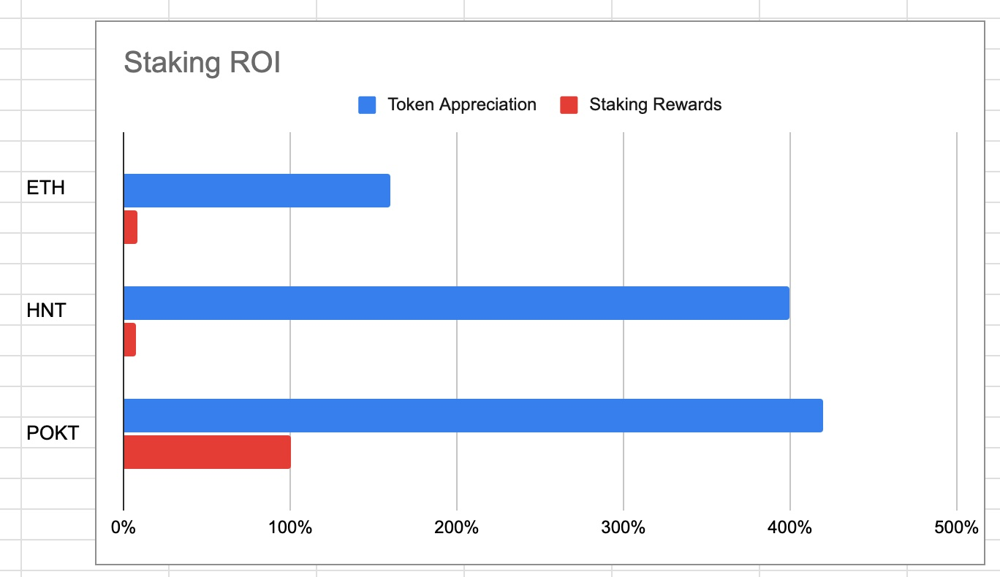

# Staking

Last year, I pooled money with some friends to run fully-staked validator nodes on 3 different blockchains. We made 3x our investment and learned a lot. Here's the stuff I found interesting:

## Inconsistent Rewards

These networks weren’t designed explicitly to infuriate little node operators, but it can seem that way. This is a general problem with proof-of-stake blockchains:

- They incentivize computers to do useful things
- Because distributed state is hard, they pseudo-randomly elect a little group of computers at any given time to actually do the useful thing
- Therefore, the computers spend very little time doing the useful thing, so the earnings are sporadic

Every proof-of-stake system has this randomness in the earnings. This makes it very frustrating to run 1 node, but doesn’t matter at all when running 100+ nodes. In other words, it’s only bad for the little guys.

Here is 1 month of earnings for my ETH validator... can you guess which 2 days I proposed a block?

The opportunity to propose a block is pseudo-random (luck-of-the-draw). Sometimes, I went months without proposing a block. It’s really difficult to determine if I was just unlucky, or if I had misconfigured the validator in some subtle way.

A similar mechanism exists on the Helium network:

HNT validators only earn when they're in the "consensus group." Election to the consensus group is pseudo-random (luck-based), but then better performance helps you stay in longer.

Pocket has a similar phenomenon -- you stake your POKT & then wait for a "session" to come around. Several nodes are pseudo-randomly assigned to the session (luck), but then only the best nodes in that batch earn any tokens (performance, based on low latency).

## Solution

This problem of rewards-consistency is common across proof-of-stake and proof-of-work systems, and the response is similar: pooling resources! Staking services & mining pools are very good for the ecosystem.

## Staking Services

Initially, I thought staking services were bad. But they’re actually great.

When staking ETH, the big services (Lido, Coinbase, etc) seemed fundamentally opposed to the core tenant of cryptocurrency: decentralization. In an effort to combat this, I decided to stake some ETH in the most “decentralized” way possible.

I bought an Intel NUC on NewEgg, a 4TB NVMe stick, 32GB of ram, a battery backup, and 2 separate fiber-optic internet providers. I installed Ubuntu, Geth for the ETH1 client, and Prysm for the ETH2 client. I then staked 32 ETH to this tiny box, tethering my financial future to a 35W machine in my son’s bedroom (I’ve since moved it to a friend’s house).

Here’s what I learned:

- Decentralization is not an end in itself. It is only useful to a certain threshold.
- Competition is a much more pragmatic goal for a healthy network. As long as there are multiple, independent staking providers competing for market-share, then everybody wins.

## Why are staking services better?

### Reliability

Why do startup founders use cloud providers to host their websites? Don’t they have perfectly good computers at home?

^^ If you don’t know the answer to that question, then we can’t be friends. Apparently I can’t be friends with myself, because I hosted my ETH validator at home riiiiiight before the big Texas winter storms last year, and we lost money because of it:

I had taken significant precautions, but my battery backup only lasts for 3 hours... and we lost power for a whole week. Yikes!

### Performance

I spent a lot of time configuring linux boxes. But at the end of the day, I have other work to do, and I see diminishing returns on my efforts pretty quickly.

However, a giant staking service has a much stronger incentive to squeeze every last drop of performance out of their nodes, and in doing so, they make the network more performant.

### Downsides

These services aren’t strictly better in every way. They re-introduce some degree of centralization into the ecosystem, which has drawbacks:

- Inefficient marketplaces
  - Staked tokens are not liquid, so it’s hard to shift funds to better providers after the initial stake.
    - HNT: 5 months to unstake funds
    - POKT: 3 weeks to unstake funds
    - ETH2: Impossible to unstake funds until after “the merge” phase 2
  - Uneducated buyers lead to sleazy promotions.
- Single points of failure
  - Hacking these could have outsized effects on blockchain networks
- Proprietary tooling.
  - These rewards are a zero-sum market, so large node providers have no incentive to share their monitoring or performance tools.
  - This creates a moat that makes it even more difficult for the little guys to compete.
  - It introduces the possibility of node favoritism — the validator nodes need to gossip the blockchain data around the p2p network, but large node operators will have a strong incentive to be “nicer” to their own nodes and “meaner” to everyone else (theoretically).

## Signals to look for

- A healthy blockchain should have clear instructions that mere humans can use to operate nodes on their network. The existence of independent node runners is a good signal that competition is possible.
- There should be multiple competing non-custodial node hosting services.
- There should be multiple competing fractional staking services (for people to stake less than the minimum for 1 full node).
  - These should operate with as much transparency as possible.
  - Lido is amazing.

## What is ideal?

- For node runners, there should be multiple open-source implementations of the protocol to choose from.
  - ETH has this, but HNT and POKT do not.

## Deep Thoughts

Poof-of-stake solves a few problems, but it’s not a panacea for all economic woes. The rich still get richer, because they have more to stake (and therefore more to earn). However, because of long unstaking periods, this is actually an improvement on the proof-of-work systems. Large mining rigs can be shut down or sold (or converted to another blockchain) overnight, while it requires weeks (or months) of warning to withdraw any funds in a proof-of-stake system. It’s still possible for the whales to cut & run, but at least everyone else has some warning beforehand.

With these staking services, the network becomes less of a direct democracy and more of a democratic republic. Every holder doesn’t decide every issue, but rather they delegate to a node who they believe will provide maximum value. I wish there were more ways to encourage competition after an initial stake (something like election cycles, where you could transfer your stake to another provider but not sell it).

## Breakdown

This experiment went very well financially, but for surprising reasons. The staking returns were meaningless compared to the token appreciation. Here’s the breakdown:
***
32 ETH → 34 ETH

- Staking APY: +8% (annualized)
- Token appreciation: +160%
  - $1,200 → $3,200

***
10,000 HNT → 10,369 HNT

- Staking Return: +7% (annualized)
- Token appreciation: +400%
  - $6 → $30

***
31,000 POKT → 34,600 POKT

- Staking APY: +100% (annualized)
- Token appreciation: +420%
  - $0.31 → $1.60

***
As it turns out, the vast majority of the staking ROI comes from an anti-feature: the long unstaking periods, which force everyone to [(3,3)](https://olympusdao.medium.com/the-game-theory-of-olympus-e4c5f19a77df).

- It’s hard to sell the coins
- So there are fewer coins sold
- Due to supply & demand, this lowers supply & increases prices

## Conclusions

This forced HODLing was way more valuable than the staking rewards. I also got some hands-on knowledge of how the these different blockchains operate, and that visceral experience has helped me form better intuitions around cryptocurrency. I suspect that improved intuition will prove the most valuable in the long-run.

It's apparent that POKT staking is out-earning these other tokens, but it's not obvious how long this window of opportunity will last. I'm working on a project to help everyone, not just my friends, stake POKT. More on that soon.
