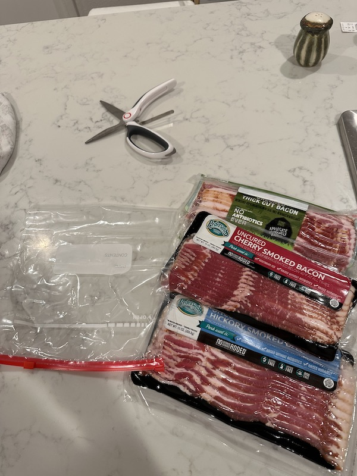
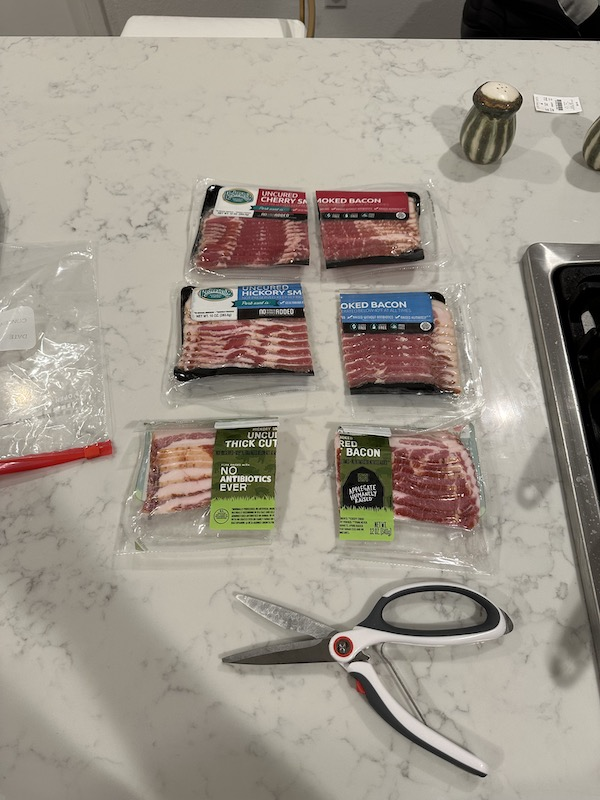
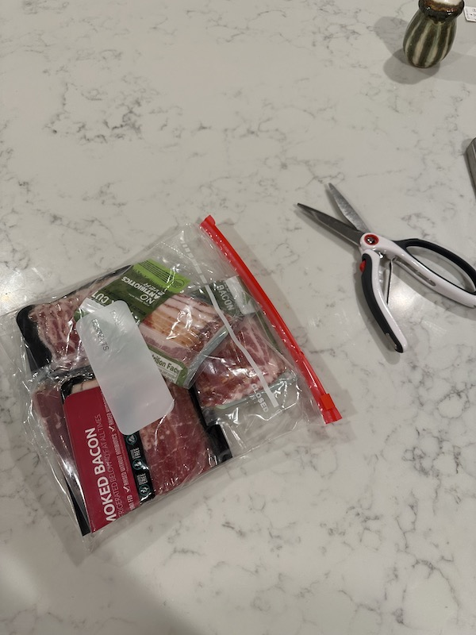
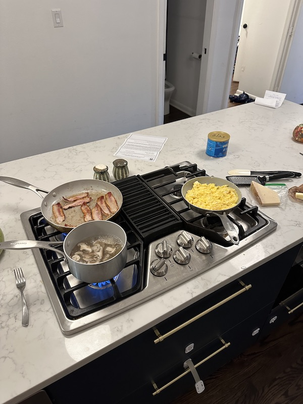

# Bacon

Look, the bacon packaging makes no sense. Terrible cooking UX.

Here's how I minimize stress:

## 1) Get a week's worth of bacon

## 2) Cut all of it in half

## 3) Put it in a big zip-loc bag, in the fridge

## 4) Pull out 1/2 pack whenever you need bacon (works great for a family of 4)

## Advantages

* It's _so_ easy to pull out of the bag, and doesn't pull or stretch.
* You only touch raw meat with 1 hand.
* The half-strips actually fit in the pan.

🎉
