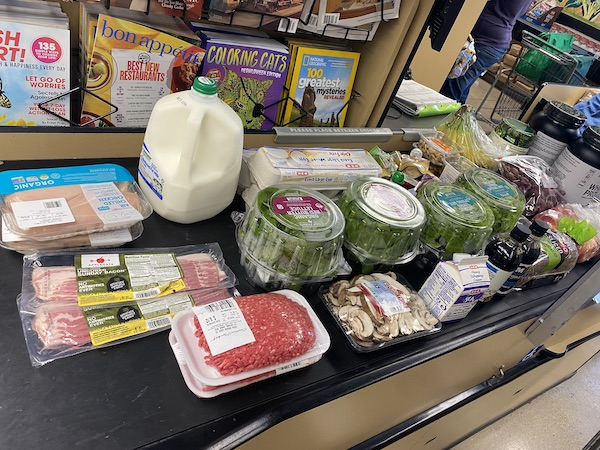
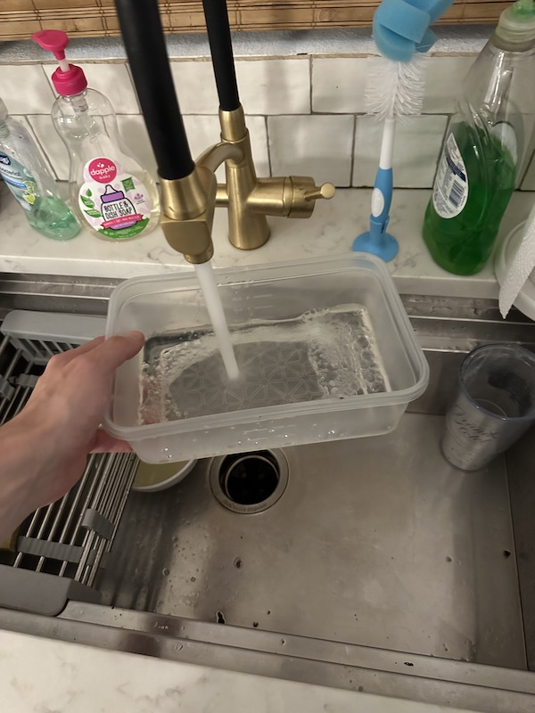
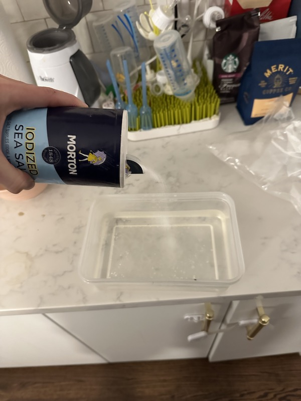
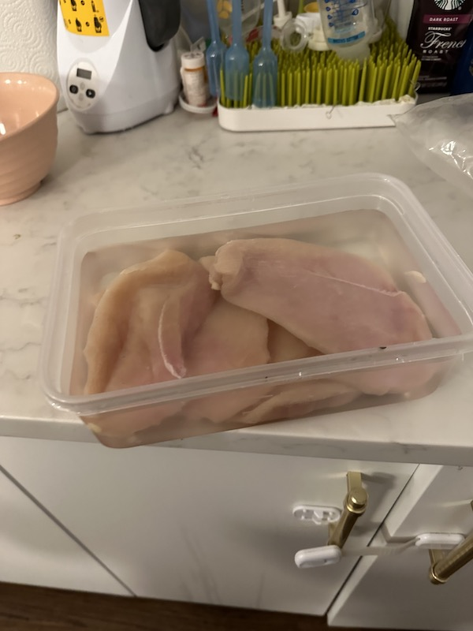
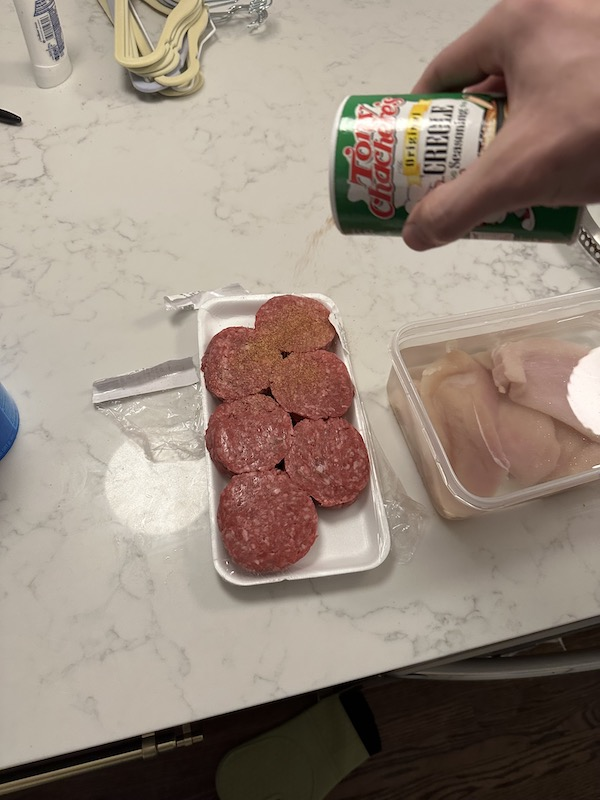
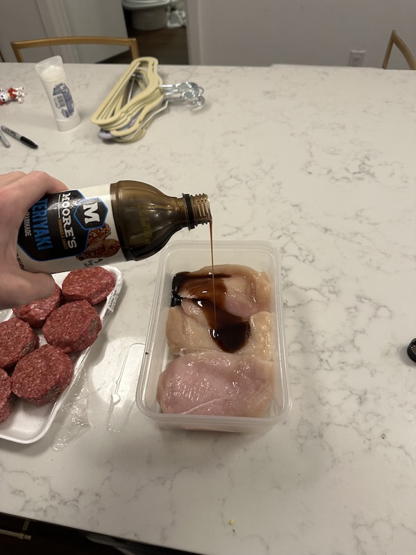
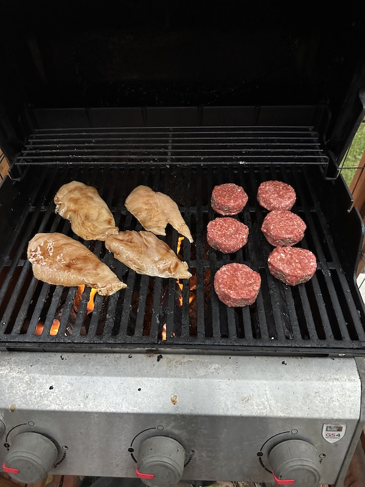
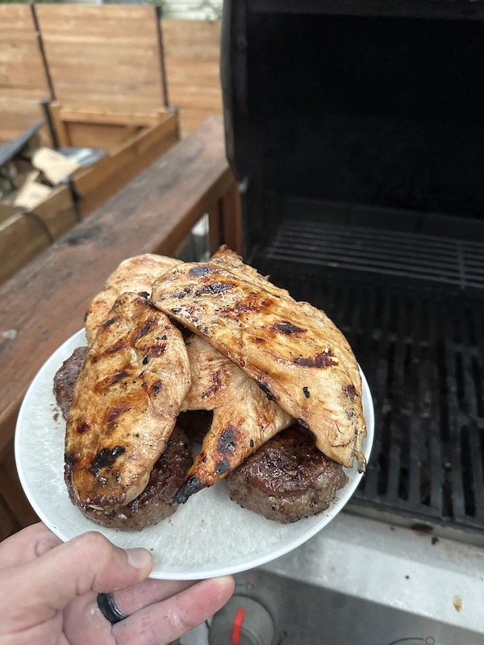
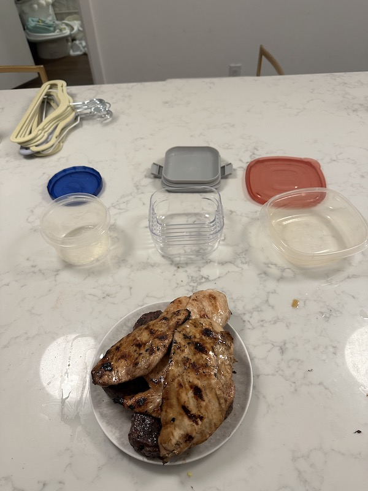

# Meat Prep

Chicken & hamburger meat is a great source of protein, but it's inconvenient to cook it for lunch every day.

Let's use some economies of scale & meal-prep. It's like the opposite of lean manufacturing.

I prep meat 2x / week, for 3 days each.

## 1) Buy a bunch of meat

* Chicken breast cutlets
* Hamburger meat
* whatever

## 2) Marinade the chicken

* Salt
* Warm Water
* Chicken
* 30 mins

## 3) Sauce

* Dry-rub on the hamburger patties
* Teriyaki (or whatever) on the chicken (after draining the water)

## 4) Grill

## 5) Tupperware

* Put some chicken & burger-meat in each container.
* Freeze 2, Fridge 1

