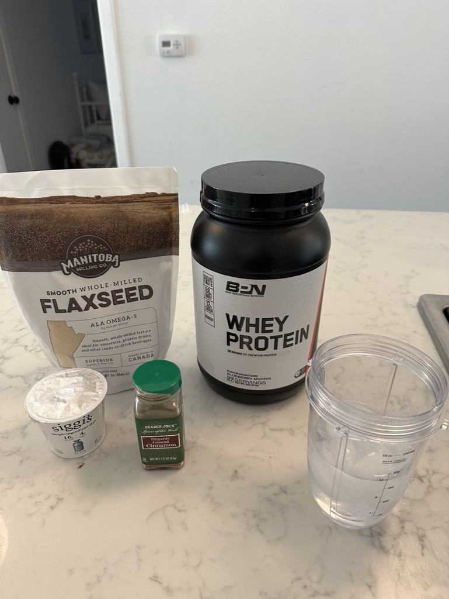
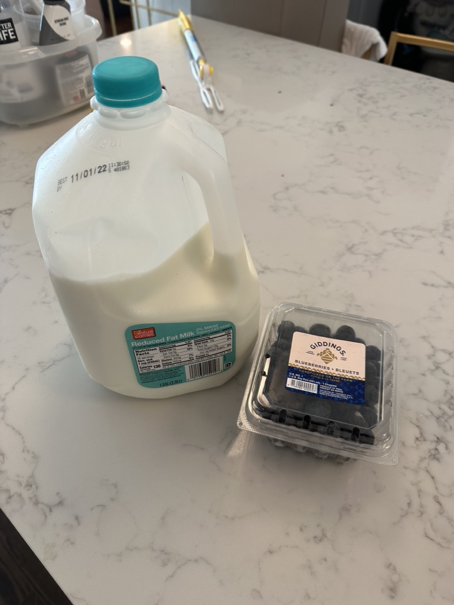

# Smoothie (cutting)

## Lots of

* Ice
* Water
* Flax Seed (ground)
  * You need _some_ dietary fiber, TRUST ME.
* [Blueberry Whey Protein](https://www.amazon.com/dp/B07XSD77VJ) (no sugar)
* Cinnamon
* Greek Yogurt
  * Careful with the carbs!

## Tiny hints of

* Blueberries (2 berries)
  * This enhances the artificial blueberry flavor in the protein
* Milk (1 tsp)
  * This is an absurdly small amount of milk
  * Like, 1 milk-cap full of milk

## Yummy

