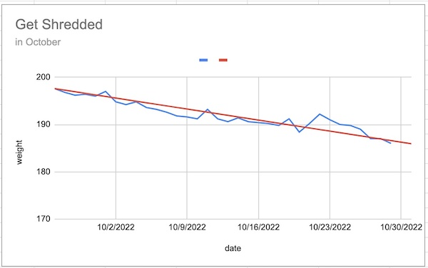

# Keto Cut (2022)

## Intro

This summer, I finally realized that body-builders work seasonally. They're _either_ bulking _or_ cutting, separately, for months at a time.

I vaguely resolved to try it. After ~intentionally bulking for a few months, I was planning to cut eventually.

Then, on a trip to Korea, I realized how thin everybody was. It seemed so obvious that my definition of "normal" is actually "obese", and that it's bad for longevity.

So, I decided to cut aggressively & run an experiment. How much fat could I possibly cut from 9/19/2022 through October?

## Original Goal

I set out to cut 1/2 pound of fat per day.

## Results

I _only_ cut 1/3 pound of fat per day, which is still pretty great. I excluded the first week from the results, because when switching to a Keto diet, the water-loss should be ignored (It's noisy data & will return when carbs are re-introduced).

* Start
  * 9/19/2022
  * 208 lbs
* Data Start
  * 9/25/2022
  * 197.6 lbs
* Data End
  * 10/30/2022
  * 186.0 lbs

View raw data [here](https://docs.google.com/spreadsheets/d/1S4l7QIQgtcMCehKXOpuFHvg-JNJHrMR3Hp19uGbl48k/edit?usp=sharing), and pics below. I'm in the best shape of my life & have more energy.

## Method

* Nutrition
  * At least 200g protein / day
  * Strict keto
  * ~2k calories
* Programming
  * Weights (2 heavy days, 2 light days)
  * Cardio (running daily)
  * Rucking (45 lbs)

## Challenges

### Tendonitis

It happened in my right foot, so I couldn't ruck or run starting around the middle of October. It took a few days to figure out a new form of cardio (I joined the YMCA and took up swimming instead). It's not nearly as convenient, but it works!

### Travel

We traveled waaaay too much. I'm talking being _in_ back-to-back weddings in different states, with kids & all. I learned that you _can_ take large amounts of protein powder & ground flax-seed in your carry-on through TSA.

### Digestion

It's important to get fiber on Keto. At first, I had some weird sense of pride in doing keto "strict" where I didn't even take dietary fiber, and this was really stupid. I... had some issues.

The trick is to ingest ~3 servings of ground flax-seed every morning & every evening (totaling ~6 servings / day), and even a small amount Greek yogurt (around a workout, because it has some real carbs).

### Energy

I had a few days where I felt really down. If I had to describe it:

* Normally, I oscillate between 0% & 100% energy throughout the day.
* On keto, I was _constantly_ at 60%.

But, with my job, sometimes 60% doesn't cut it. I would do push-ups or squats to get my blood-sugar up, drink caffeine, chug water, eat salt, eat almonds, eat super-dark chocolate (100% cacao)... and finally, I found the answer.

Try harder. No shortcuts here.

### Communication

I originally told people I was "trying to lose weight this month", and they _all_ responded with care & concern, telling me I didn't _need_ to, and silently diagnosing me with body dysmorphia (probably).

Instead, I started telling people I was "getting absolutely shredded this month", and they all encouraged & congratulated me.

Framing is important!

## Nutrition

* 6am:
  * 1/2 scoop of [Athletic Greens](https://athleticgreens.com/)
  * 1 scoop of [bland, plant-based protein](https://www.amazon.com/dp/B0021F8HH0)
  * shake with water

* Breakfast:
  * 4 scrambled eggs
    * topped w/ mushrooms
    * also topped with parmesan cheese
  * [bacon](/fitness/advice/meals/bacon)
  * avocado

* Smoothie:
  * [This](/fitness/advice/meals/smoothie_cut)

* Lunch:
  * chicken breast + hamburger meat
  * avocado
  * a handful of lettuce

* Snack:
  * plant-based protein & water
    * I usually do a [flavored](https://www.amazon.com/dp/B0B5YNWRT3/) one

* Dinner:
  * Usually skip it
  * If not, just do some shrimp or almonds or something
  * Maybe another cup of water + flax-seeds
  * Maybe snack on some 100% cacao dark chocolate (no sugar!!)
