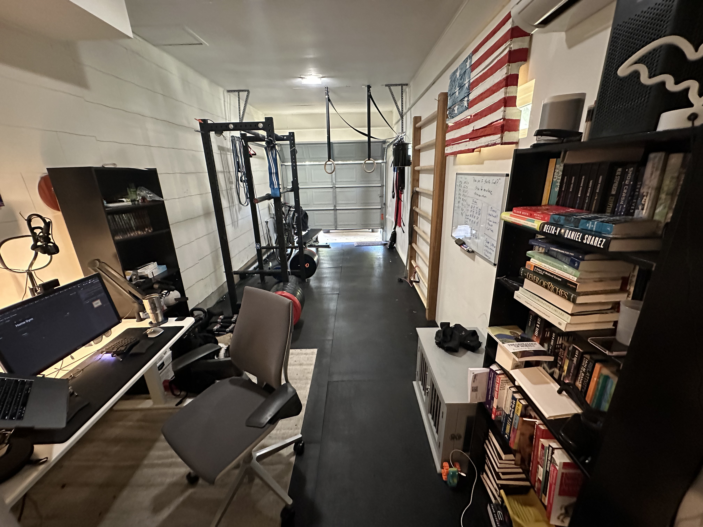
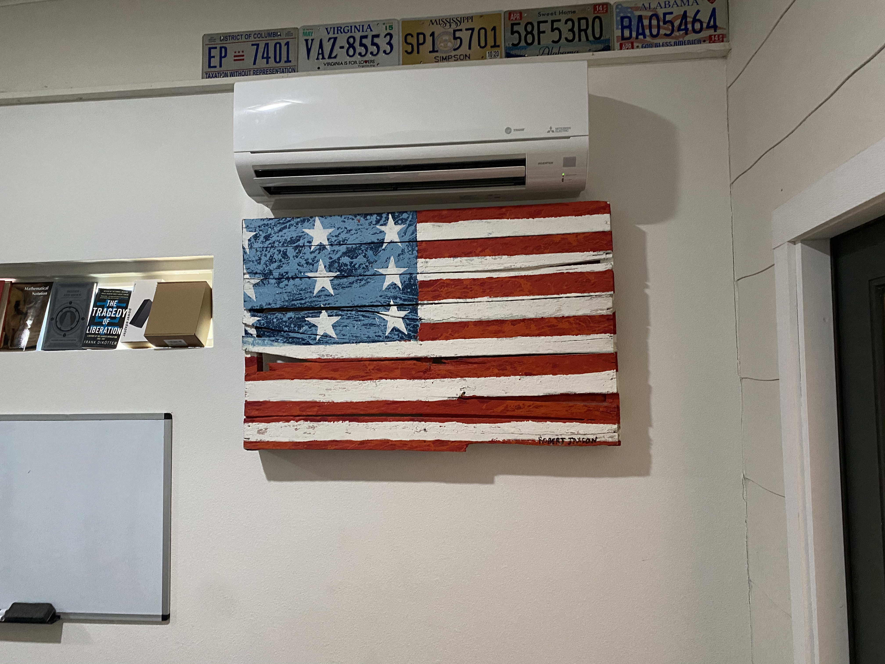
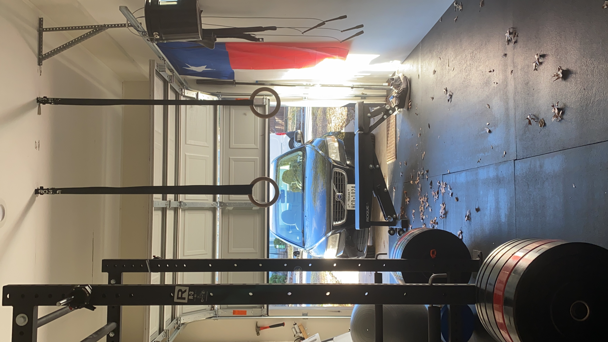
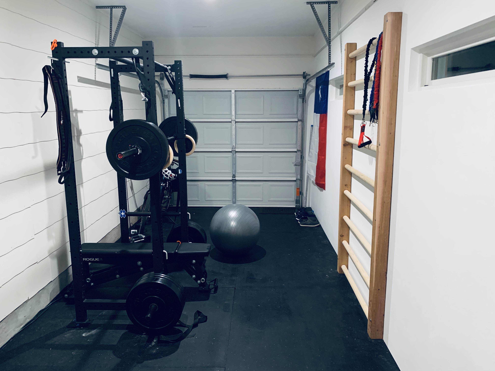
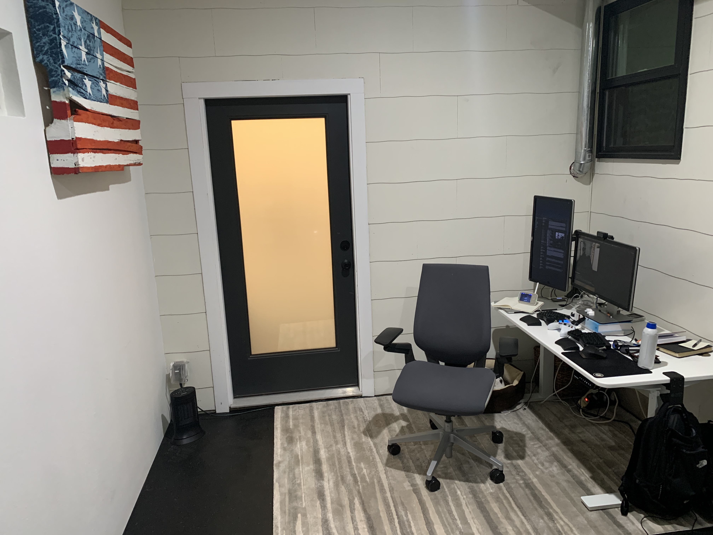
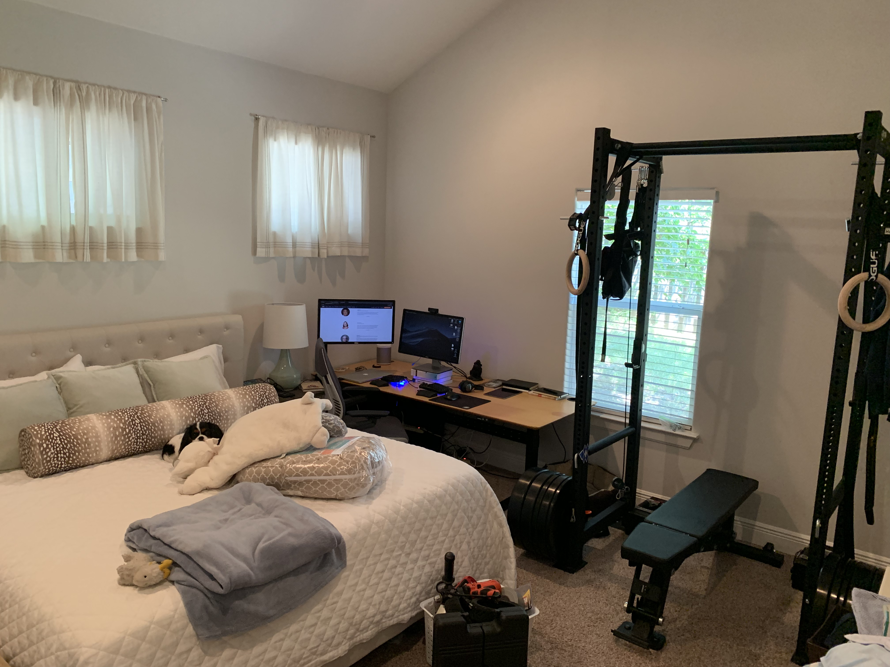
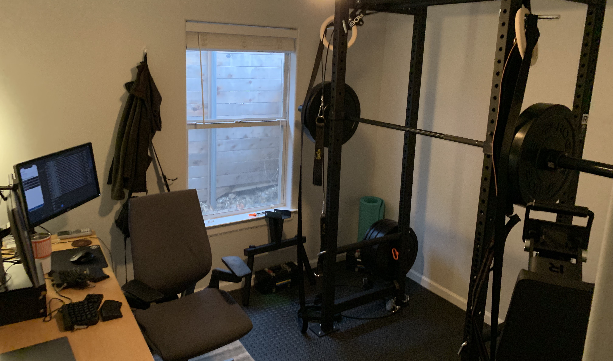
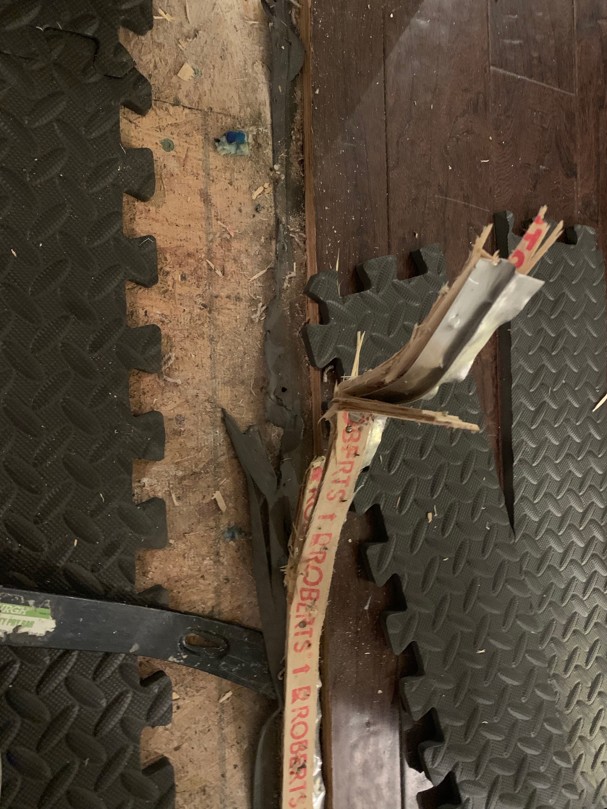
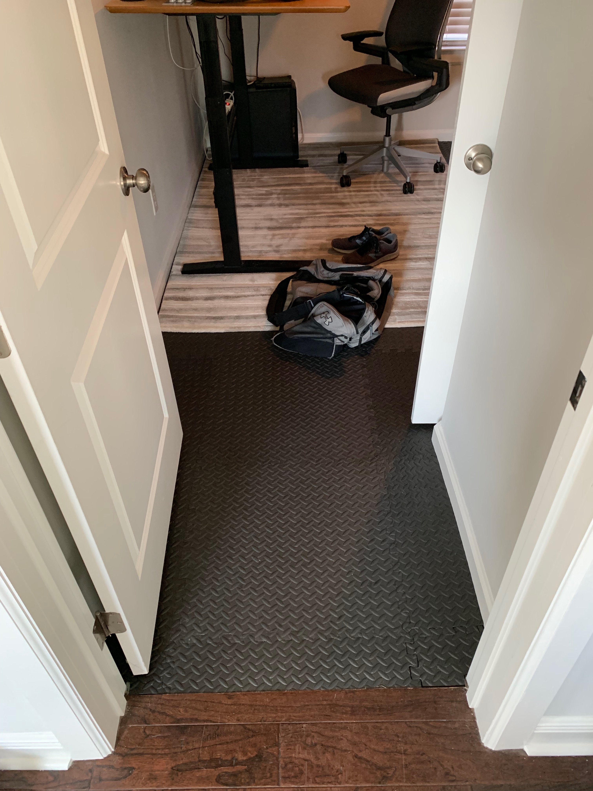
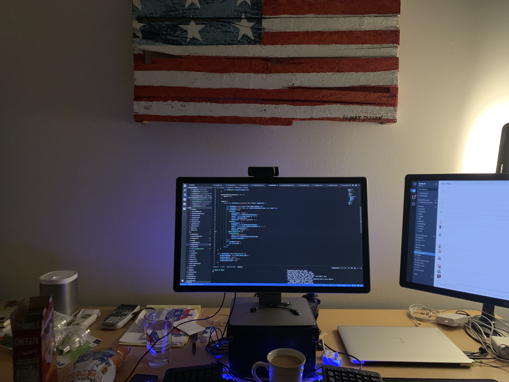

# Home Gym

I love my garage / office / gym. I've built it one piece at a time since 2019.

You can skip to the main list of equipment [here](#equipment).

# Timeline

reverse chronological order:

## March 2021

- Fun: `B+`
- Learning: `A`
- Finances: `B`

### Quarantine

I didn't build the gym with Covid / quarantine in mind, but wow, I got lucky. When I feel sad or claustrophobic, I'm sitting _right next_ to heavy weights, so I lift them, and then I feel better.

### Friends

I grew _closer_ to 2 friends during quarantine, because their gyms closed & they came here to work out.

### Mini-split AC

It's hot in Austin, so I paid to get an AC unit installed. This makes it not just a better gym, but a pretty great office.

I now WFH full-time, so I can spend 8+ hours per day in this room getting stronger, smarter, and richer.

### Accessories

I bought more stuff:

- jump-ropes
- bands
- wrist straps
- squat belt
- chalk
- more weight plates (I can deadlift lots)

Oh, and I mounted my rings on the rafters:

***

## December 2019

- Fun: `A`
- Learning: `B+`
- Finances: `B`

This 3rd iteration of my home gym is AWESOME!!!

### New Garage

- We moved
- The new house has an actual garage
- I put in good rubber floors (horse-mats from Tractor Supply Co)
- I built wooden stall-bars for stretches

### Smaller Desk

- I got a smaller standing desk
- I have SO MUCH ROOM for activities

### Pros

- So much more room
- Stall-bars are helpful for stretches (I started gymnasticsbodies.com)
- The house-walls are well insulated & basically soundproof
- The squat cage is much more stable now that I've mounted it to the concrete (as opposed to plywood)

### Cons

- No HVAC in the garage, I'll need to figure that out when it gets hot

***

## October 2019

- Fun: `C`
- Learning: `B`
- Finances: `B`

I don't love this 2nd iteration of my office-gym. We're having a baby, so the old room became a nursery. But the equipment didn't just disappear...

I now have an office / gym / bedroom (and a cool wife who hasn't murdered me yet).

I have some regrets... but it's still kind-of awesome!

***

## March 2019

- Fun: `B`
- Learning: `B+`
- Finances: `D`

### Problem

- We have a (small) rental house with no garage

- I want to squat, bench, and do pull-ups at home

### Solution

- Change the floor in my office
- Buy a bunch of weights
- Cram it all in there

### Pros

- It's a great conversational piece
- I work out more often
- The equipment is fantastic & meets all my needs
- It's fun to have friends over to work out

### Cons

- The floor material was cheap & has warped so that it bubbles
- Sometimes, the whole point of going to the gym was to leave the house (not anymore!)

### Equipment

$3.5k -- compared to a $60 / month gym, it will pay for itself in 5 years. Compared to a \$150 / month crossfit gym, it's only 2 years. Did I do crossfit before? No, but the numbers make it sound better.

I bought the following equipment:

- [Rogue R-3 Power Rack](https://www.roguefitness.com/rogue-r-3-power-rack?prod_id=48709&gclid=CjwKCAjwxrzoBRBBEiwAbtX1n5TiiUOybjyDMU6rnJNK4yIy3YoMygzaHvBOlTAmVIJmfxJ0TP6pxxoCkMUQAvD_BwE) -- It's great, big enough!
- [Rogue Adjustable Bench](https://www.roguefitness.com/rogue-adjustable-bench-2-0?prod_id=25843&gclid=CjwKCAjwxrzoBRBBEiwAbtX1n17GfFxUiMcTu0OH_tZefSEWLY8eWe3KDBjR-WNDTLiYUVqeSSr6-RoCNr0QAvD_BwE) -- I should have bought a cheaper bench
- [Rogue Wood Rings](https://www.roguefitness.com/rogue-wood-rings) -- These were great!
- [Rogue Matador](https://www.roguefitness.com/the-rogue-matador) for dips, would NOT recommend, squat cage wobbles violently during use
- [PowerBlock-70 Dumbbells](https://www.gtechfitness.com/powerblock-elite-70-dumbbell-set/) -- These are great!
- [Spud Inc Pulley](https://www.roguefitness.com/spud-inc-pulley-systems) -- This is super useful, don't get the second-pulley-extender though, I never use it.
- [Weighted Dip Belt](https://www.amazon.com/Dark-Iron-Fitness-Leather-Lifting/dp/B01N1L4IHR/ref=pd_lpo_sbs_200_t_1?_encoding=UTF8&refRID=1TNKE67QJMCAXKNEY7S5) -- I use it for weighted pull-ups, it's great!

### Opinions

I really like having this stuff at home. It's so much fun.

The floor was more difficult than I imagined. We kept the carpet (un-cut), and only had to pull up 1 piece of tac-board at the threshold:

The final floor looked great:

But now it's warped (due to heat & use), so the pieces don't fit together anymore (they overlap significantly, no pic). I should have got nicer floors.

It also looks _great_ next to my desk, and the American-flag-pallet really ties the room together:

Plus, I can use my standing-desk, monitor, and web-cam as a mirror to watch my form:

^^ what a guy!
