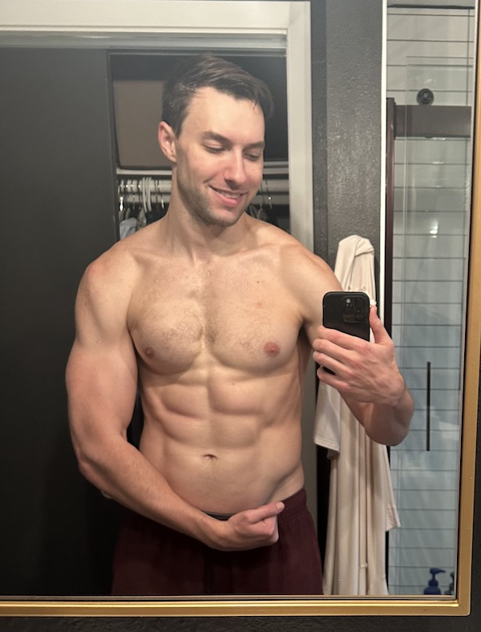
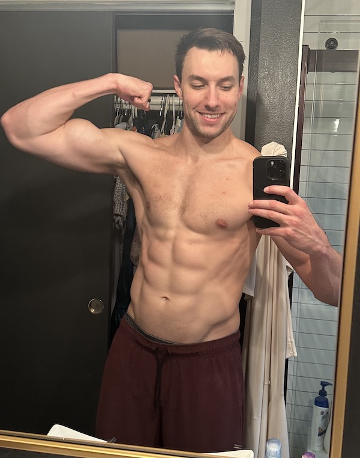

# Fitness

Programmers aren't usually paragons of fitness, but I believe our physical bodies are important and precious. I want to be extremely lean for energy, longevity, and aesthetics.

I'm a father of 2, a staff engineer at Coinbase, and have waaaay more extra-curricular activities than normal (church, friends, projects etc). I work out < 2 hours per day, 4 days per week.

You can view my experiments [here](experiments), my programming [here](#bulking), and my thirst-trap just below.

## General Advice

* be patient, work in phases. First build muscle, _then_ cut fat

* _always_ eat 200g protein / day

* re-arrange your [environment](home_gym) to make working out easier

* consistency is king; this requires resolve.

## Bulking

Allow 2 or 3 months to build lots of muscle, and don't be afraid of gaining a little fat. Getting shredded is a ~6 month journey. Don't take shortcuts.

### Bulk Program

Use [this spreadsheet](https://docs.google.com/spreadsheets/d/1kWoa_W7le1Zh_3ufNy17Y8w4l0YEzz7ELM6V2n9-FOg), adapt it to your schedule. I like to do front-squats on Fridays, and I throw in weighted pull-ups & lots of auxillary stuff.

TODO: put my actual bulk program on here.

I also paired it with extreme stretching exercises after lifting, abs 3 days, and core 2 days. (TODO: write down my complete workout).

Only do cardio 2x / week, and never _after_ lifting.

### Bulk Nutrition

* First thing in the morning, eat (or drink) 30g protein.
* Eat at least 200g protein / day
  * You need supplements to hit this target
    * 2 scoops plant-based protein
    * 1 or 2 scoops whey protein (any more destroys my bowels)
* Eat some veggies (chicken + rice + veggies is easy to prep in bulk)
* Don't shy a way from carbs
* Don't gorge yourself with milkshakes and oreos, unless you want to.

(TODO: specific bulking daily diet).

## Cutting

Allow 2 or 3 months to cut the fat while keeping the muscle. This is the fun part, but it's mentally tougher.

### Cut Program

* Monday: heavy lower body + cardio
* Tuesday: heavy upper body + cardio
* Thursday: light lower body + cardio
* Friday: light upper body + cardio

### Cut Nutrition

* First thing in the morning, eat (or drink) 30g protein
* 200g protein / day
* 2k Calories / day
* Keto (extremely low-carb)
  * I swear this helps, but am running an experiment to confirm.

## Results so far

* Best mile time: 5:58

* Bench: 295

* Squat: 345

* Deadlift: 460

