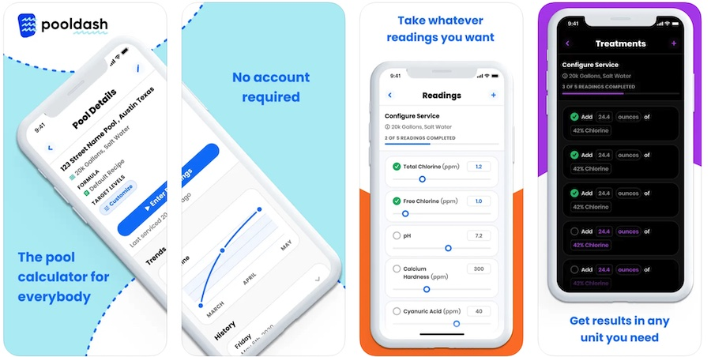
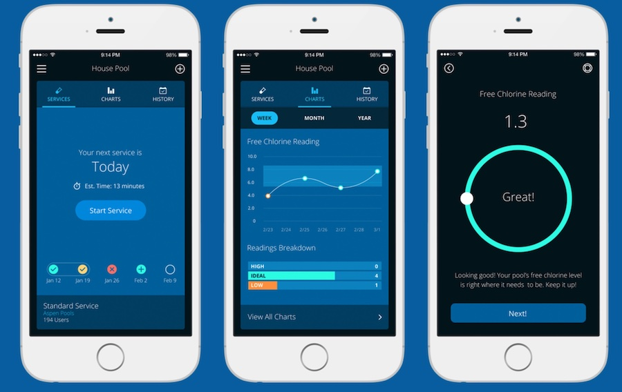
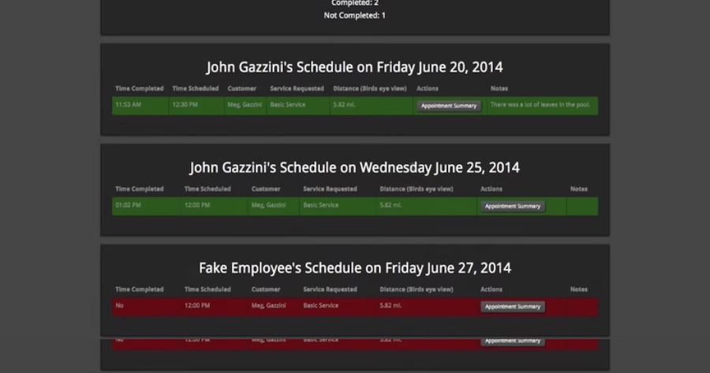
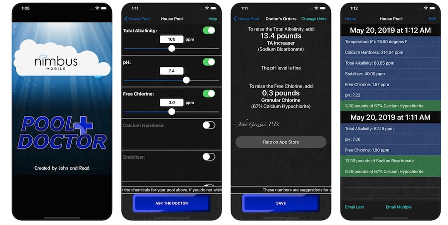

# Graveyard

I've been pursuing this problem for a while:

## Pool Dash

That's this current project, started in 2020.

There is a web-app, mobile app, and a [forum](https://forum.pooldash.com).

## Pool Cloud

This was 2013 - 2015, a really smart friend & I tried to make a pool-chemistry-subscription-box business.

We made some complicated software that looked _great_, but never got close to selling chemicals.

## Feather Serve

This was 2012 - 2014. A really smart friend & I made software for pool service companies.

Here are some [video demos](https://player.vimeo.com/video/98755969), and a rough screenshot:

We got a few customers & sold the company for $30k, and then I worked for the acquirer for a year.

## Pool Doctor

In 2010, I was a "head lifeguard" at the country club I had worked at for 5 years. I maintained the chemistry in 3 pools & made an app to help me. I released it on the App Store & started updating it in response to user feedback.

This app cost $1, then $2, and then $10. It made around $10k in the last year before I made it free (2015).
