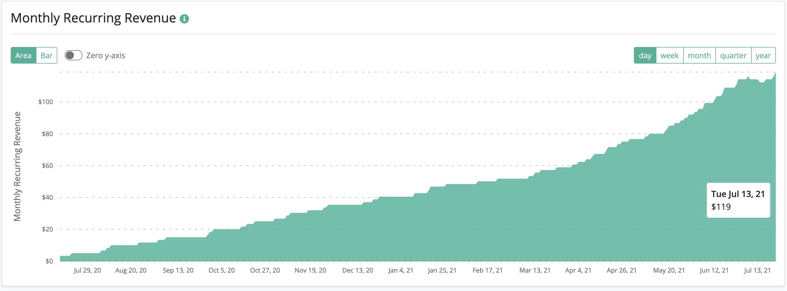

# Pooldash

I'm building [pooldash.com](https://pooldash.com)

## Principles

- Build what users ask for
- Build a product I enjoy working on
- Go deep, not wide

That's the whole strategy -- time to execute!

## Progress

(reverse chronological order):

### November 2022

- Learning: `C`
- Fun: `B`
- Finances: `F`

I helped another dev land a job through this project (that's... 8?). I love directly helping individual people; it's my antidote to the "greater good" BS that many software companies claim. My altruistic, anti-entropic projects aren't intertwined with my employer's fiduciary duty to its shareholders.

This is what God has called me to do at the moment -- I don't see many steps ahead, but I'll keep working.

I'm glad I made the app free. It's eliminated a whole category of not-fun concerns for now, and I can just invite people to help me build an awesome product.

***

### August 2022

- Learning: `B`
- Fun: `D`
- Finances: `F`

This project has been ongoing for 2 years. Financially, it's not great (130 paid subscribers). It has, however, been a great way to help aspiring engineers bridge to their first real programming job. I've also had fun working on every feature... _except_ for billing.

Following my 2nd principle for this project, I'll just make it free so that I don't have to consider billing anymore. This way, I'll have more fun.

While I'm at it, I'll make the whole thing aggressively open-source (AGPL license). I suspect this will be _even more fun_, as I can respond to user's feature-requests with a link to the code-changes (and possibly stream development on Twitch).

This project is now explicitly art, rather than business.

In summary:

- I've helped 5 people get their first tech job
- The app is now free and open-source

Next up, I'll build out online sync (like I've been saying for years, but putting off because billing is so tedious).

***

### July 2021

- Learning: `B`
- Fun: `B`
- Finances: `F`

It's this project's 1-year anniversary! I'm still having fun building it, but we're only at $100 monthly recurring revenue... so let's hope "slow and steady" still wins the race.

- I had my first [issue](https://forum.pooldash.com/t/salt-issue-add-624-lbs/125) with users creating formulas for eachother. Someone wrote a formula that only worked if your pool had the same volume as theirs, and lots of other people used it (yikes!).
- We simplified the UI, added lots of animations, improved the formula-editor, and re-organized the forum.
- Our designer (Katie) and other developer (Victoria) are improving the web experience.
- I'm trying to migrate users from Pool Doctor (my old pool app) to pooldash.
- 2,600 Installs, 68 paid subscribers

***

### May 2021

- Learning: `B`

- Fun: `A`
- Finances: `F-`

I've helped 3 people get their first full-time tech jobs. I just quit my job to focus on pooldash full-time (funded by selling bitcoin and some [other crypto](/crypto/helium)).

- I need to make shorter [developer update videos](https://www.youtube.com/watch?v=NUAXkvuS0sw)
- Bailey, Cole, and Shayne all have full-time jobs now (pooldash was a good stepping-stone)
- We added a monthly subscription option, a volume estimator, imperial units, and "skipped" readings
- Up next: make the app (and website) more approachable
- 1,950 Installs, 51 paid subscribers

***

### March 2021

- Learning: `B+`

- Fun: `A`
- Finances: `F`

I love mentoring people, but most of them need opportunity (not advice).

- I hired 3 talented, ambitious, up-and-coming engineers
- Update videos are [getting better](https://www.youtube.com/watch?v=ynUf3ZiCrWg)
- We added custom target ranges
- We're working on the recipe editor (moved to Vercel)
- I'm having so much fun
- 1,300 Installs, 31 paid subscribers

***

### November 2020

- Learning: `B+`

- Fun: `B`
- Finances: `B-`

The Tiger King documentary inspired me to film myself doing unusual things.

- I started filming [update videos](https://forum.pooldash.com/t/developer-update-2/58)
- A few more users posted in the forum, I made some features for them
- I shipped the scoops feature
- I made a recipe for hot-tubs with natural products (that require less sanitizer)
- I'm working on data-export
- 839 Installs, 18 paid subscribers

***

### July 27, 2020

- Learning: `B+`

- Fun: `A`
- Finances: `B-`

I finally took this project from 0 -> 1 paid subscribers... feels good! Now it's time to iterate for a few years.

- I got my first paying user 🎉
- I waddled in ambiguity researching the [volume vs weight](https://forum.pooldash.com/t/custom-scoop-sizes/25/2?u=gazzini) problem, got nowhere (whoops)
- I started coding work on scoop sizes, didn't ship it yet
- I _decided_ to add a monthly pricing plan, but haven't built it yet :)
- 434 installs, 1 paid user

***

### July 20, 2020

- Learning: `B+`

- Fun: `A-`
- Finances: `C+`

I finally got some _public_ feedback in the forum... hopefully this effort pays off.

- I created new forum categories to encourage users to post (it worked!)
- I now have 1 real forum user (and he's in the Netherlands!!)
- I discussed some features with him (scoop sizes, chem names)
- I talked with several friends about why they think I have 0 paying users
- I emailed several users of my old app about paying for my new app, none seemed interested
- I didn't make any recipes or deploy any code (whoops)
- 347 installs, 0 paid users

***

### July 12, 2020

- Learning: `B-`

- Fun: `C`
- Finances: `B-`

Nobody is posting in the forum, the recipe editor is _barely_ functional, going to keep iterating...

- I got an email from a user of my old app asking me to support dichlor shock, so I made a [recipe](https://pooldash.com/recipe/glum_marriage_172/edit) for it & posted in the [forum](https://forum.pooldash.com/t/shock-with-dichlor/34)
- I made it possible to remix your own recipe, not just someone elses.
- 264 installs, 0 paid users

***

### July 5, 2020

- Learning: `B+`

- Fun: `B`
- Finances: `A`

I finally launched this thing... I had to take some shortcuts for the sake of shipping, but it feels good.

- I released the [iOS](https://apps.apple.com/us/app/pooldash-water-calculator/id1505607801) and [Android](https://play.google.com/store/apps/details?id=com.gazzini.pooldash) apps (built using React Native)
- I released the [recipe-editor](https://pooldash.com/recipes)
- I deployed a [forum](https://forum.pooldash.com) (using [Discourse](https://www.discourse.org/)) to avoid individual email-support in the future
- 0 installs, 0 paid users

***
