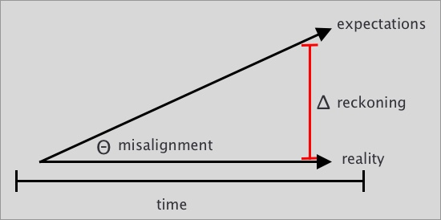
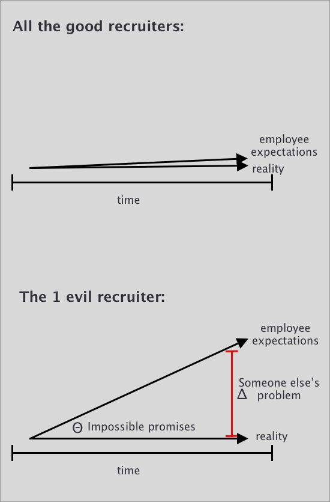
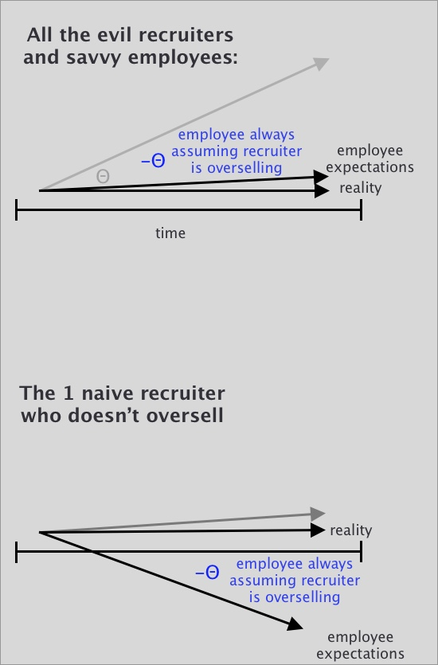

# Alignment

## Internally

I've managed a few small teams, and the worst situations always happen when I avoid conflict early.

Hypothetically, if Sam does 3 problematic things, I might only address 2 of them. Maybe I don't want Sam to think I'm mean, or maybe I need Sam to stay encouraged. Regardless of my intent, it becomes increasingly difficult for me to address that 3rd behavior, and increasingly burdensome to spin my wheels serving as an unnecessary intermediary in Sam's interactions, trying to create a buffer between that 3rd behavior and the rest of the office. This is obviously stupid and unsustainable, and becomes more awkward to correct over time.

This often creeps up in more subtle ways. A developer might provide a lot of critical feedback on every new round of designs. I want the designer to feel empowered and trusted, but I also want the developer to care about the overall product. It's perfectly possible to strike a good balance & accurately communicate with everybody... However, it's human-instinct to optimize each message for the receiver, and to sliiiightly oversell the degree to which I agree with the developer's criticisms, or to soften those same criticisms when speaking with the designer. These little tweaks, which feel like hard work & good management in the short-term, can really snowball over time.

To minimize the magnitude of reckoning:

- A good manager will force the reckoning sooner
- A great manager will avoid the misalignment in the first place
- An excellent manager will avoid this misalignment without making anyone feel bad

## Externally

Unfortunately, many people believe that the role of a great recruiter (or salesperson, marketer, director, or anybody) is to actually increase the degree of misalignment in the above graph... In other words, that they should oversell. In a large enough company, someone else downstream will have to deal with the reckoning:

If this incentive system goes unchecked, it quickly devolves into a situation where everybody knows that everybody oversells, and so the common wisdom is to mentally discount any promise made by a salesperson, recruiter, marketer, engineer, or really anybody:

I've noticed that a lot of mentorship involves helping newcomers recognize the overselling for themselves & learn to navigate these worlds of semi-truths & complex incentives. I've also noticed that this flavor of BS is always bad for the overall system / company / marketplace / world.

## Conclusion

Externally, this pattern is unavoidable. Free markets will always be susceptible to some assumed misalignment, although regulations can help.

Within a company, however, this behavior is toxic. Whenever I see a team sugar-coating metrics, I know that it won't be fun to work in implementation at that company. When the rubber meets the road, the fingers will start pointing.

## Misc

Here are some other things that I did to make myself miserable as a new manager:

- Lacking the confidence to make hard decisions, and offloading them to someone more confident but less informed
- Waiting waaaay too long to fire people
- Reading a lot of books on management, and expecting _my_ manager to immediately live the ideals of those specific books
- Trying to manage former peers without intentionally, drastically resetting the relationship

I can avoid most of these by constantly asking myself what issues I'm avoiding today, and pursuing the ones that might turn into big issues later.
