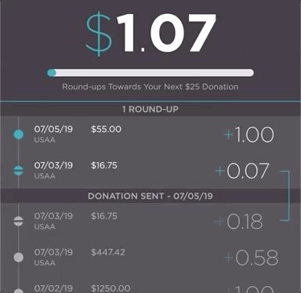

# Sprinkles

Small efforts can drastically change the perceived value of our work. This is true _everywhere_, and I think most people would benefit from a simple framing-exercise.

It takes a monumental amount of effort to just _show up_ for work:

- be born
- survive until adulthood
- learn skills
- interview well
- wake up, shower, etc...

Once you're there, it's comparably _very little_ effort to go the proverbial extra-mile. Why would you dedicate a significant portion of your time to a job just to half-ass it? You're already _there_, you're already _doing it_, so why not do it well? In the context of your-life-so-far, you've done 99.999% of the work, and it takes .001% more effort to stand out & appear excellent.

Personally, I'm much happier when I over-exert myself than when I under-do it. Sure, everyone is different, and it can be toxic to tether your happiness to short-term productivity. However, I'm confident of this: I'm deeply joyful when I give my 100% effort to a task, and much less-so when I only give 90%. The excellence-by-default attitude creates a sense of fulfillment in a hard-day's work along with some feeling that I'm living close to my full potential.

# Attitudes are Contagious

A single person's attitude here can set a precedent for co-workers, stirring everyone to either strive for excellence or settle in mediocrity. It's obviously more fun for everyone when the team is striving & thriving. There are many well-known [adages](https://thenextweb.com/apple/2011/10/24/steve-jobs-obsession-with-the-quality-of-the-things-unseen/) that describe this, but here is an example from a recent project of mine:

It's 2017, and I'm the sole iOS developer at a startup (and also the sole backend dev, and also the CTO). We have no salaries, so I'm also doing freelance client-work for ~35 hrs / week. We do, however, have some key partnerships with aggressive deadlines, and I'm feeling the pressure.

Our designer is talented & passionate, but he's also remote & has never designed an iOS app before. I have to push back on some obviously-impossible aspects of his designs. However, I can tell that he worked very hard, and the comps look _great_. So, when considering other challenging-but-technically-possible details, I actually found myself encouraged to just implement them, because it was fun to build something great.

Notice the vertical blue-bar connecting the 7-cent transaction to the 18-cent transaction:

And here, can you even tell which version of the intro screens required more effort?

It would be difficult to argue for the real business-value of either of these changes, but anecdotally, our sales-person was excited to sell the final product. He shamelessly laid his relationship-equity on the line & called in all kinds of favors to land product-demos and eventually close some contracts.

I hope these small changes, which I consider to be sprinkles-on-top, added up to create some sense of magic in the product -- that users might subconsciously notice it was built by a team of people that care. This is probably not the case, as it had no measured impact on conversion rates, & our salesperson assured me that "we could have sold this app if you had built it half as good", and the designer has since quit, and I've since quit... but the company still exists, and is still growing (slowly). Among startups, this is a rare victory, and I think this attitude mattered.

# Things to Avoid

Some people I know try to save up their energy, and "just get through the day" to then enjoy the nights / weekends / whatever. I don't think emotions really work like that, in the sense that I'm most fulfilled when I pour myself out completely.

My challenge is that I'm commonly stretched too thin. I overcommit myself to multiple projects, friendships, travels, etc... to the point of exhaustion. Often, in the midst of multiple deadlines, I'm tempted to take shortcuts. These usually take the form of:

- Bad code (no refactoring, incomplete tests)
- Skipping functionality (I'll file a separate "UI Polish" ticket & never do it)
- Just communicating the "what", not the "why", to team members
- Being under-prepared for planning meetings (tickets drastically under-specced)
- Taking an extreme "less-is-more" approach to managing jr developers
- Not preparing for 1-1s thoroughly

Or, to be more general, I'll just half-ass stuff. I tend to under-estimate the negative consequences in the moment, but they can snowball over time into 2 things:

- A bad reputation
- A mediocre company culture

Shortcuts can sometimes be great -- and in fact, focusing on a single, core experience while ignoring large secondary features can be a competitive advantage that allows teams to move _fast_.

However, it's always best to plan for shortcuts upfront, so that your strategy remains cohesive & everyone's expectations are managed accordingly. If everyone feels involved in the strategy of being intentionally scrappy, it can actually become a fun, quirky rallying-point for the entire team. Unfortunately, I often get this wrong, and instead it just seems as if my development team has under-delivered on seemingly obvious features. This upfront communication of shortcuts is _vital_, and it's not just about the information itself -- it's how you sell it to stakeholders.

# Advice for Young Engineers

Go work where you can give extra effort & be rewarded for it. You should strive to set your own limits, and not simply to meet expectations of the process around you.

Especially early in your career, you can usually read your pull-requests carefully before committing & guess what critical feedback you'll receive. Rather than trying to slip something through, strive to be proactive & do refactors before submitting it for peer-review.

Look for common patterns or any recurring bits of boilerplate-code, and try to create a general, reusable solution. Actually read your teammate's pull requests, and if they create any such abstractions or syntactic sugar, it will be very encouraging if you just use it in your own code without being explicitly prompted.

[Always try your best at everything you do](https://biblehub.com/colossians/3-23.htm), and if it feels like you're swimming upstream, quit.
