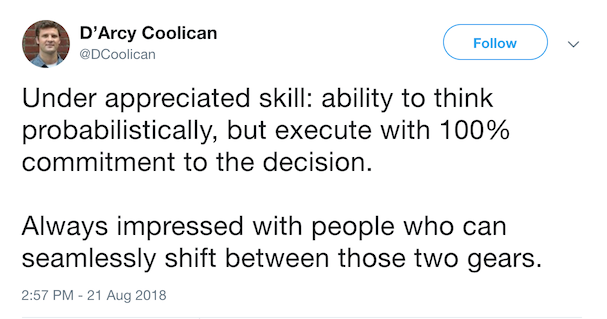

# Failure

It’s easy to make statements about how failure leads to growth, but in practice, it can be quite painful. This is fresh for me, but before I get into that, let’s distinguish 2 types of failure:

1) Shallow Failure: These are small failures, that often begin with the knowledge that success is unlikely. Perhaps the most shallow of failures is something like this: “We tested 100 different variations of this online advertisement, analyzed the conversion data, and selected only the 3 highest-performing versions.” In this scenario, there were 97 failures, learning occurred, and nobody (hopefully) was impacted on an emotional level… there was little pain, it’s a cold, scientific calculation… it’s very easy to argue that you’re now smarter for having experienced those failures.

2) Deep Failure: These are much more personal, painful, and interesting. For instance: “I dedicated most of my teenage years to exercising and practicing football. We lost the state championship game by 1 point.” This is difficult, creates real pain, and builds character (maybe). Unfortunately, it’s difficult to argue that you’re now a better athlete than somebody who did win the state championship.

As I grow, I’m having to combine these 2 notions of failure. Here is a recent tweet that sums it up pretty well:

I have spent the last few years building equity in very early-stage startups. Individually, these each have a low probability of success. However, in the aggregate, there is a good chance that at least one of them will succeed. It's easy to perform that emotionally-detached calculation, but it's actually very hard to spend months or years of my life, all-in, on the implementation details of a single venture. Put another way:

Can you imagine a sports-movie where, before the season starts, the coach tells the team: “We only have a 13% chance of winning the championship this year, but I plan to coach here for 10 years, so I’ll likely win one at some point!” That would be very un-motivating, and it seems intuitive that this attitude would drastically lower the team’s probability of success.

I’m still figuring out this balance: it’s currently on my mind because an early-stage company I worked at for 2+ years recently discontinued my product (a remote tutoring service). I poured my time & energy into that service, and yielded a high return in terms of personal development:

- I’m a much better engineer. The opportunity to work under Dan Kokotov (Chief Architect of rev.com) was one of the most valuable experiences of my life, and the engineering skill I acquired there has already been opening doors for me.
- It was my first “real” management experience: progressing from engineer to team lead was a big step for me — it was my first glimpse into formal mentoring / hiring / firing.
- I fostered relationships that will add immense value to all areas of my life.

From a cold economic perspective, I came out on top (salary was good). However, I obviously feel sad that it failed... Here is my best attempt to reverse-engineer those feelings:

- I am happy when working towards [mastery, autonomy, and purpose]({{< ref "/writing/interesting_work" >). The discontinuing of this product reduces the “purpose” in that equation.
- If the service was a huge success, I could proudly point to it for the rest of my life and say “I helped create that, and had a huge impact on its direction & success.” Now, there is nothing to point to — it will be difficult to receive external validation for the work I put in there.
- There are some changes that I pushed for, which I suspect would have increased the chances of success, but were never tried (rebranding etc..). I might have been wrong, though.
- I don’t actually know, for sure, why it failed. I know that the cost-to-acquire-a-customer was higher than the lifetime-value-of-a-customer, but I don’t really know why.

Anyways, working at that company was great. In terms of personal ROI (which is timelessly summed up [here](https://www.biblestudytools.com/esv/matthew/passage/?q=matthew+13:3-8)), rev.com was very fertile soil, and my time there was invested wisely (btw, all of their other product lines are wildly successful).

Looking to the future, all of my past experiences are informing future ventures, and when it comes to what other people think about past failures, I yield to Dr. Seuss:

>Those who mind don’t matter, and those who matter don’t mind.

Onwards!

## 2 years later

After 2 more years, and 2 more projects, this still rings true. It's too early to tell, but it looks like 1 of the projects will likely fail, and the other will probably succeed.

I recently encountered a TS Elliot poem ([4 Quartets, East Coker, V](http://www.coldbacon.com/poems/fq.html)), and I'm wrestling with whether I buy into this detachment-from-results, or if it is a sort-of cowardly defense mechanism. Here is a key excerpt:

>For us, there is only the trying. The rest is not our business.
